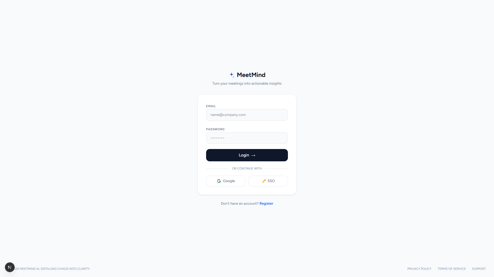
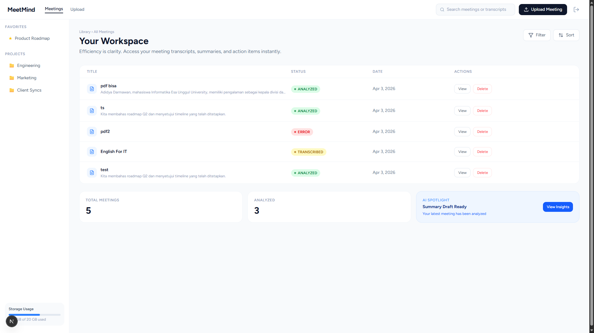
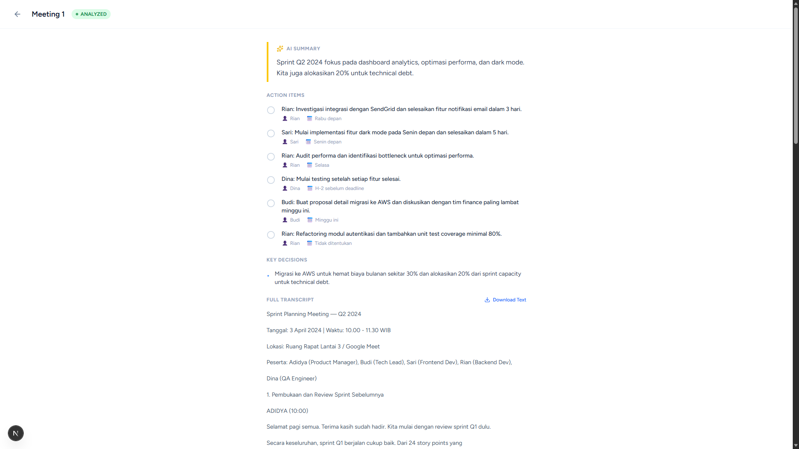

# 🧠 MeetMind

> AI-powered meeting notes summarizer — Turn your meetings into actionable insights instantly.


## ✨ Features

- 📤 **Upload Meeting Files** — Support audio (.mp3, .wav, .m4a) and text (.txt, .pdf)
- 🎙️ **Auto Transcription** — Powered by Faster-Whisper (local, no API needed)
- 🤖 **AI Analysis** — Generate summaries, action items, and key decisions via Groq LLaMA
- 🔐 **Authentication** — JWT-based auth with secure password hashing
- 📊 **Dashboard** — Manage all your meeting notes in one place
- 📋 **Detail View** — View full transcript, summary, action items, and key decisions

## 🛠️ Tech Stack

### Backend
- **FastAPI** — High-performance Python web framework
- **PostgreSQL** — Relational database
- **SQLAlchemy** — Async ORM
- **Faster-Whisper** — Local audio transcription
- **Groq API** — LLaMA 3.1 for AI analysis
- **Docker** — Containerization

### Frontend
- **Next.js 14** — React framework with App Router
- **TailwindCSS** — Utility-first CSS
- **shadcn/ui** — UI component library
- **Axios** — HTTP client

## 🚀 Getting Started

### Prerequisites
- Docker Desktop
- Node.js 18+
- Groq API Key (free at [console.groq.com](https://console.groq.com))

### Installation

1. **Clone the repository**
```bash
   git clone https://github.com/AdidyaDmwan/meetmind.git
   cd meetmind
```

2. **Setup environment variables**
```bash
   cp .env.example .env
```
   Fill in your values:
```env
   DATABASE_URL=postgresql://meetmind_user:meetmind_pass@db:5432/meetmind_db
   SECRET_KEY=your-random-secret-key
   GEMINI_API_KEY=your-groq-api-key
```

3. **Start the backend**
```bash
   docker-compose up --build
```

4. **Start the frontend**
```bash
   cd frontend
   npm install
   npm run dev
```

5. **Open the app**
   - Frontend: [http://localhost:3000](http://localhost:3000)
   - API Docs: [http://localhost:8000/docs](http://localhost:8000/docs)

## 📡 API Endpoints

| Method | Endpoint | Description |
|--------|----------|-------------|
| `POST` | `/api/auth/register` | Register new user |
| `POST` | `/api/auth/login` | Login and get JWT token |
| `POST` | `/api/meetings/upload` | Upload meeting file |
| `POST` | `/api/meetings/{id}/summarize` | Analyze with AI |
| `GET` | `/api/meetings/` | List all meetings |
| `GET` | `/api/meetings/{id}` | Get meeting detail |
| `DELETE` | `/api/meetings/{id}` | Delete meeting |

## 📁 Project Structure
meetmind/
├── backend/
│   ├── app/
│   │   ├── api/          # Routes & dependencies
│   │   ├── core/         # Config, DB, security, AI
│   │   ├── models/       # SQLAlchemy models
│   │   └── schemas/      # Pydantic schemas
│   ├── Dockerfile
│   └── requirements.txt
├── frontend/
│   └── src/
│       ├── app/          # Next.js pages
│       ├── components/   # Reusable components
│       └── lib/          # API client
├── docker-compose.yml
└── README.md

## 📸 Screenshots

### Login Page


### Dashboard


### Meeting Detail


## 📄 License

MIT License — feel free to use this project for your own portfolio!

---

Built with ❤️ by [AdidyaDmwan](https://github.com/AdidyaDmwan)